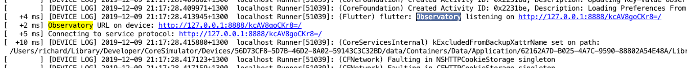

# ogurets_flutter

*ogurets* is a Gherkin + Cucumber implementation in Dart, focused on making your life writing tests as easy as possible,
with the minimum of boilerplate fuss. *ogurets_flutter* is a flutter extension to ogurets which adds support for:

- Running against an existing running application (as long as you know the observatory port)
- Starting the application for you and controlling it to ensure it is allowed to Restart and set its state back
to the beginning without having to quit and rerun the application
- Terminating the application (or not) on completion
- Allowing you to set a default for restarts or no-restarts and use Gherkin tags to control behaviour.

Rather than repeat how Ogurets operates, check out its [documentation](https://pub.dev/packages/ogurets). 

## installing

in your `dev_dependencies` section in your `pubspec.yaml` include:

`  ogurets_flutter: ^1.2.5`

or whichever is the higher version you see on this page.

## using Ogurets Flutter

When doing Gherkin steps with this plugin, you will generally want to have access to the flutter driver. As per the
example, you can just inject this. Your test runner will had these additional features:

```dart
void main(args) async {
	var def = OguretsOpts()
    ..feature("test_driver/features")
		..instance(FlutterOgurets())
		//..step(...)
        ..step(FlutterHooks)
        ..step(FlutterOguretsHelperStepdefs) // if you want to use the extended steps
	;

	await def.run();
}

```

If you are using the [IntelliJ Plugin](https://plugins.jetbrains.com/plugin/12687-ogurets--cucumber-for-dart) then
this file and these additions are created for you automatically (as it detects it is a flutter project). 

When you wish access to the driver, just inject it as you would anything else.

e.g.

```dart
import 'package:ogurets/ogurets.dart';
import 'package:ogurets_flutter/ogurets_flutter.dart';

class CounterStepdefs {
  final FlutterOgurets _world;

  CounterStepdefs(this._world);

  @Then(r'the counter is {int}')
  void theCounterIs(int counter) async {
    // ...

  }
}
```

### vscode

If you are using Visual Studio Code, you can debug the tests by adding a section like the following to your `launch.json`.  This is for the example solution in the repository.

```jsonc
{
            //Can't run this with the normal working directory because the Dart plugin helpfully tries to launch Flutter, and we 
            //want to run it as dart. 
            "name": "Debug E2E Tests",
            "request": "launch",
            "type": "dart",
            "program": "ogurets_flutter_test.dart",
            "cwd": "example/test_driver",
            "env": {"OGURETS_FLUTTER_WORKDIR":"..", "OGURETS_FLUTTER_START_TIMEOUT":"120", "OGURETS_ADDITIONAL_ARGUMENTS":""},
          }
```
The `ogurets_flutter_test.dart` file would have to be modified to look for features in that directory as well, since the launch configuration changes the cwd so that tests can be debugged.  Otherwise, the Dart Code plugin attempts to launch as a Flutter rather than Dart debugger.

```dart
    ..feature('test_driver/features/counter.feature')
    ..feature('features')
```

## environment variables

If you wish to control the flutter run via your own command line build, then the important environment variables are
the same as ogurets but with the extension of:

- OGURETS_FLUTTER_FLAVOUR - this passes "--flavor ${OGURETS_FLUTTER_FLAVOUR}" to flutter run. Note the International
English spelling.
- OGURETS_FLUTTER_DEVICE_ID - this passes "-d ${OGURETS_FLUTTER_DEVICE_ID}" to flutter run letting you specify a device
to run on.
- OGURETS_ADDITIONAL_ARGUMENTS - lets you specify any arguments you wish. Arguments in quotes are broken up
correctly.
- OGURETS_FLUTTER_START_TIMEOUT - lets you override the default 60 second timeout to wait for the application to start. 


## notes

*ogurets flutter* cannot be used from the command line tool `flutter driver` because the library it needs to know what 
the observatory port is (which is how Flutter and the Flutter Driver communicate). If you wish to include it in your test 
runs (say on CodeMagic), just use Dart itself and run your _test.dart runner, it will start your main app and control it.

All of the normal Ogurets extensions work 

e.g. 
````shell script
flutter emulators --launch apple_ios_simulator
echo ios emulator launched
echo running e2e tests
export OGURETS_FLUTTER_FLAVOUR=dev2
export CUCUMBER_FOLDER=test_driver/features
echo codemagic build servers are a wee bit slower than my laptop so...
export OGURETS_FLUTTER_START_TIMEOUT=480
dart --enable-asserts --enable-vm-service:59546 test_driver/runner_test.dart
````

If you wish to use the `flutter driver` command line tool, use *ogurets* directly and just enable the driver in
an instance of your own to make it available to your steps. 

 
## screenshots

*ogurets_flutter* can take screenshots for you if you are having difficulty in specific environments or if you just
 wish to capture specific screenshots at a particular scale. 

For when you want to determine what is going on, particularly in a headless test environment, if you tag your test with 
`@FlutterScreenshot` and ensure the environment variable `SCREENSHOT_DIR` has been set, then we will take screenshots _before_ 
every step and once the scenario ends. All screenshots are time stamped and put in the directory you have specified
with the `SCREENSHOT_DIR` variable. Any missing directories in this list will be created as part of the test.

If you wish to capture screenshots with a specific name, then there is a step for this - and it's intended use is
to capture screenshots for "whats new" screens or for when you are uploading your application to the stores. For this there
are 3 available steps to control this:

- I take a screenshot called {string}
- I set the maximum screenshot height to {int}
- I set the maximum screenshot width to {int}

Furthermore, if you have an extra environment variable called SCREENSHOT_PLATFORM you can easily change the platform
between each run of your Cucumber tests and capture different platforms (such as the four recommended for iOS). 

### debugging

If you wish to run and debug your Flutter app as a separate process from your Ogurets run, you need to follow the 
below steps:

- create a new run profile that points to your "main" used in your Flutter Driver tests. Then add in the Additional
Arguments to this run configuration `--observatory-port 8888` (or chose some other port).
- start the application and look for the line when the build spits out: `Observatory URL on this device: http://127.0.0.1/XXXX`,
e.g. 
- open your test run configuration and you will see a field called Observatory URL - paste this link in there. If this
is in place when the IDE runs, it will not attempt to run the Flutter app, simply connect to it. From the command line,
this is done using the environment variable `VM_SERVICE_URL`.

At this point you can now operate in normal Flutter development mode, changing code, adding widget tags, debug points
and so forth, and re-running your tests again and again as necessary.

## authors

- _Irina Southwell (nee Капрельянц Ирина)_, Principal Engineer (https://www.linkedin.com/in/irina-southwell-9727a422/)
- _Richard Vowles_, Software Developer (https://www.linkedin.com/in/richard-vowles-72035193/)

We also thank Jon Samwell of _Flutter Gherkin_ for his idea (and core code) for managing the run of the the application. It has been
heavily modified in this version.
 

